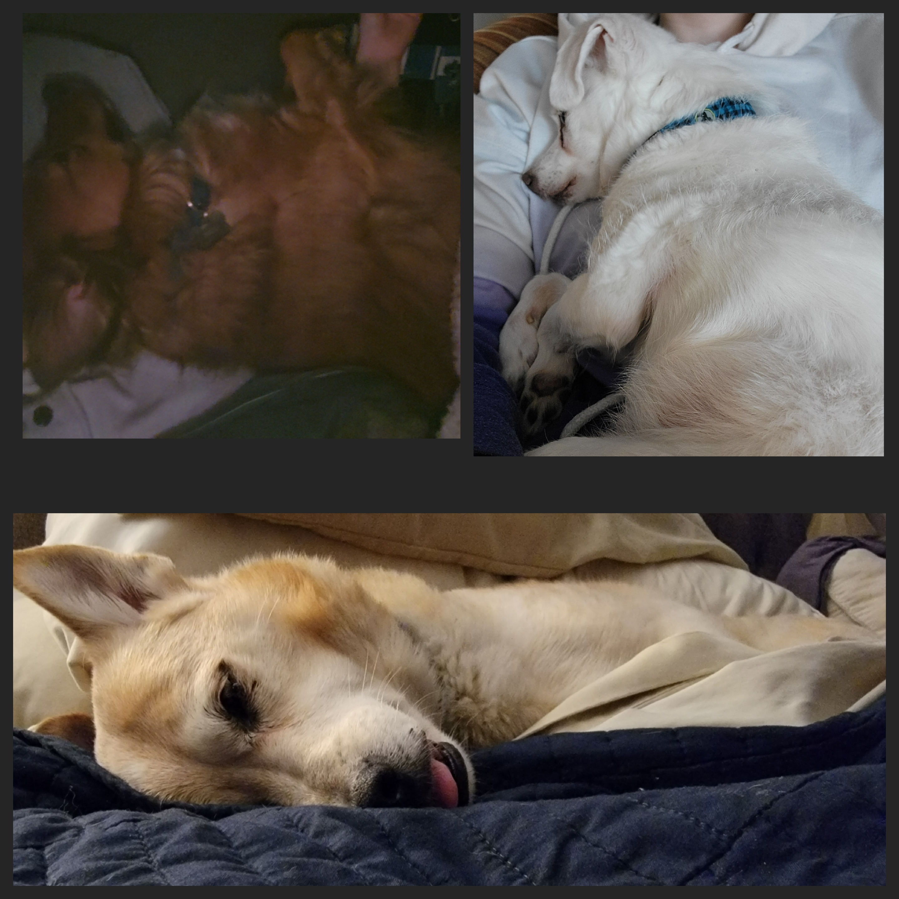
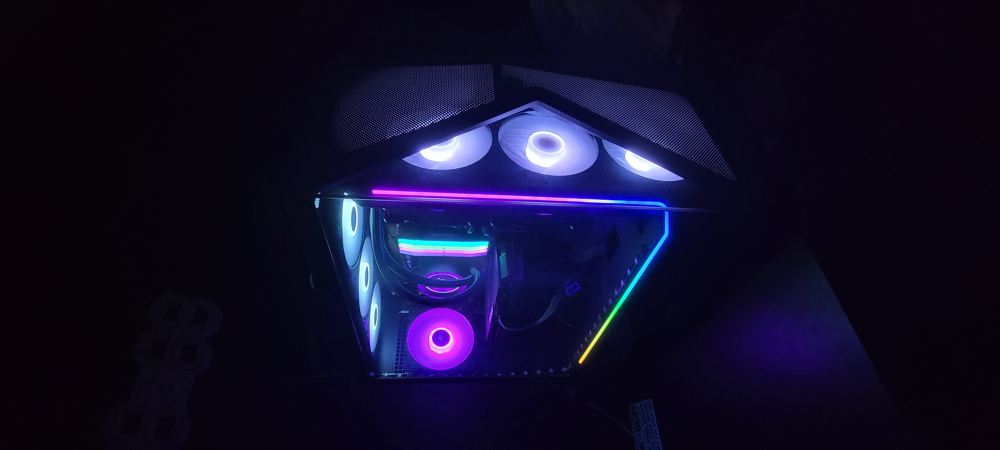
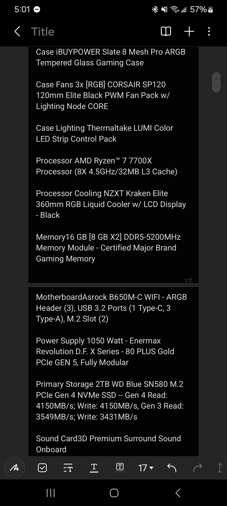

# _Evelyn ("E-V") Myers_

## _Where are you from_

I am from the Northwest Suburbs by the Wisconsin border.

## **_First Computing Device_**

My first computing device was actually my dad's desktop. The OS was Windows XP, which was the operating system that had the deafult Office Assistant paperclip "Clippy" with the eyeballs [Windows XP](https://en.wikipedia.org/wiki/Windows_XP "Wiki page for Windows XP") (2001) [Office Assistant](https://en.wikipedia.org/wiki/Office_Assistant "Wiki page for Office Assistant") (2000).

## _IT Interest_

I have a few backgrounds of study. My first few are in the Arts (acting, theater, and band), Psychology, and Criminal Justice. I graduated from community college in '22 with a Gen. Eds and Arts degree, then transferred to do Criminal Investigation. I finally ended up here at IIT in fall of '23. Since then, I have been studying ITM & Cybersecurity.
I have been building computers since I was about 9 or 10 years old, with the assistance of my older brother. I always thought of it as building legos. Since then, I have always had an interest in technology.
I currently work at Geek Squad back home resolving issues on multiple different pieces of tech (iPhone repairs, laptops hardware and software repairs, desktop hardware and software repairs, building gaming rigs, etc.).
My favorite thing to do, however, will always be taking apart computers and servers, and putting them back together.

This is the gaming desktop that I just build last year (2024):

These are the specs for said PC:

## _Something Interesting About You_
I play in a Summer/Fall Softball league. I also play paintball on occasion when it isn't freezing cold out.
